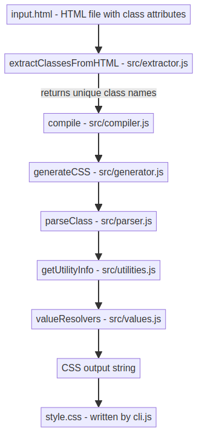

# ChaiTailwind CSS

A lightweight, Tailwind-inspired **utility-first CSS compiler** built in plain Node.js. It scans an HTML file for utility class names (like `bg-blue`, `p-8`, `flex`), resolves each one against a set of utility/value mappings, and generates a ready-to-use CSS stylesheet - no build tooling, no config, no external dependencies.

---

## ✨ Features

- 🔍 Extracts utility classes directly from your HTML `class="..."` attributes
- 🧩 Maps utility prefixes (`bg`, `p`, `flex`, `items`, `justify`, `border`, etc.) to real CSS properties
- 🎨 Resolves values via lookup tables - colors, spacing, radius, font weight, alignment, and more
- ⚙️ Simple CLI: point it at an HTML file, get back a CSS file
- 🪶 Zero dependencies - pure Node.js

---

## 📁 Project Structure

```
chaiTailwind/
├── cli.js              # CLI entry point
├── input.html          # Demo/test HTML file with utility classes
├── style.css           # Generated CSS output
├── package.json         
└── src/
    ├── extractor.js     # Extracts class names from HTML
    ├── parser.js        # Splits a class into utility + value
    ├── utilities.js     # Maps utility prefixes → CSS properties
    ├── values.js        # Resolves tokens → real CSS values
    ├── generator.js     # Builds a single CSS rule from a class
    ├── compiler.js       # Orchestrates the full HTML → CSS pipeline
    └── index.js         # Browser-side/demo entry file
```

---

## 🚀 Getting Started

### 1. Clone the repository

```bash
git clone https://github.com/Sahilgupta2175/ChaiTailwind-CSS.git
cd ChaiTailwind-CSS
```

### 2. Create `package.json`

If the project doesn't already have a `package.json`, generate one and configure it for this CLI tool.

**Option A - generate interactively:**

```bash
npm init
```

Answer the prompts (or press Enter to accept defaults), then edit the resulting file to match the configuration below.

**Option B - generate instantly with defaults:**

```bash
npm init -y
```

This creates a basic `package.json`. Next, open it and replace its contents with the following, which points `main` at the compiler module, registers `chai-tailwind` as a CLI binary, and adds `compile`/`test` scripts:

```json
{
  "name": "chaitailwind",
  "version": "1.0.0",
  "description": "",
  "main": "src/compiler.js",
  "bin": {
    "chai-tailwind": "./cli.js"
  },
  "scripts": {
    "compile": "node cli.js input.html style.css",
    "test": "node cli.js input.html style.css"
  },
  "keywords": [],
  "author": "",
  "license": "ISC",
  "type": "module"
}
```

**What each field does:**

| Field | Purpose |
|---|---|
| `main` | Sets `src/compiler.js` as the package's main module (what other code imports when it requires `chaitailwind`) |
| `bin` | Registers `chai-tailwind` as a global command that runs `cli.js` - enables usage like `npx chai-tailwind` once linked/published |
| `scripts.compile` | Shortcut: `npm run compile` → runs `cli.js` against `input.html`, writing `style.css` |
| `scripts.test` | Currently aliased to the same compile command (placeholder until real tests are added) |
| `type: "module"` | Tells Node to treat `.js` files as ES Modules, so `import`/`export` syntax works throughout `src/` |

### 3. (Optional) Link the CLI globally

Since `bin` points `chai-tailwind` at `./cli.js`, you can link it locally to run it as a real terminal command:

```bash
npm link
```

Then run it from anywhere in the project:

```bash
chai-tailwind input.html style.css
```

### 4. Run the compiler

Using the npm script:

```bash
npm run compile
```

Or directly with Node:

```bash
node cli.js input.html style.css
```

**CLI options:**

| Argument | Default | Description |
|---|---|---|
| input file | `input.html` | HTML file to scan for utility classes |
| output file | `style.css` | Where the generated CSS is written |
| `--help` | - | Prints usage information |

---

## 🧠 How It Works

ChaiTailwind reads your HTML, pulls out every unique utility class, resolves each one against its utility/value mappings, and writes out a matching CSS rule for it.

**Example input:**

```html
<div class="bg-blue p-8 font-bold"></div>
```

**Generated output:**

```css
.bg-blue {
  background-color: blue;
}

.p-8 {
  padding: 2rem;
}

.font-bold {
  font-weight: 700;
}
```

### Pipeline Flowchart


### Module Responsibilities

| Module | Responsibility |
|---|---|
| `extractor.js` | Regex-extracts every `class="..."` value from HTML, splits on whitespace, dedupes via a `Set` |
| `parser.js` | Splits a single class token into `{ utility, value }` (e.g. `p-8` → `p`, `8`) |
| `utilities.js` | Maps a utility prefix (`bg`, `p`, `flex`, `items`, `justify`, `border`, ...) to its CSS property and value type |
| `values.js` | Lookup tables/resolvers for colors, spacing, radius, font weight, display, alignment, justify-content, border widths |
| `generator.js` | Combines the parsed class + utility metadata + resolved value into a finished CSS rule |
| `compiler.js` | Top-level pipeline: extract → generate → join into a full CSS string. Exports `compile` and `generateCSSFromHTML` |
| `index.js` | Browser/demo entry point - reads the live DOM and logs generated CSS to the console |
| `cli.js` | Node CLI wrapper - reads the input file, runs `compile()`, writes the output file |

---

## 🛠 Supported Utilities (examples)

| Class | Generated CSS |
|---|---|
| `bg-white` | `background-color: white;` |
| `bg-blue` | `background-color: blue;` |
| `p-8` | `padding: 2rem;` |
| `flex` | `display: flex;` |
| `items-center` | `align-items: center;` |
| `justify-between` | `justify-content: space-between;` |
| `font-bold` | `font-weight: 700;` |
| `rounded-lg` | `border-radius: ...;` |
| `border-2` | `border-width: 2px;` |

---

## 🗺 Roadmap

- [ ] Support for responsive prefixes (`sm:`, `md:`, `lg:`)
- [ ] Config file for custom color/spacing scales
- [ ] Watch mode for live rebuilding on file changes
- [ ] For Future goal, npm publish so `chai-tailwind` can be installed globally via `npm i -g chaitailwind`
